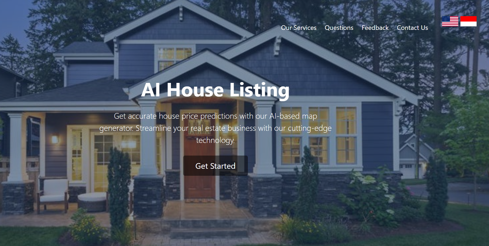

# InHousePredictor

  
  

# Manual
We have used Django as platform for connecting html, css, javascript, and our AI Model.
In order to install Django, you first need Anaconda version lower or equal to 23.1.0.
It requires Python version 3.9.19, scikit-learn version 1.0.2, Pandas version 2.0.1. 
1. To first install Django using Anaconda check this website from tutorialspoint: https://www.tutorialspoint.com/how-to-install-django-in-anaconda
2. Once Django is installed you can either download the entire repository as a zip or in your terminal type 'git clone https://github.com/rielmvp/InHousePredictor.git '
3. 

4. In command shell, type in "conda activate "Your_Virtual_Environment""
5. cd InHousePredictor
   cd mywebsite
   python manage.py runserver
6. An ip-address that looks something like 'https://127.0.0.1:8000/ will show.  Press 'Ctrl'+'left mouse click'
7. 
8. You will be able to see the webpage show up
9. Once the webpage shows press 'Get-Started'
10. Select the appropriate values by clicking on each of the buttons and selecting 'Address, number of bathrooms, bedrooms, listing area, certificate, and Jakarta Division' 
11. Press 'Get Prediction' then you will get an Ai-based prediction of your house's price.
12. If you have any more questions, scroll down and check out the 'contact us' section below.
13. Thanks!

# AI Model Explanation

## Data Scraping
We scraped 12,000 data from https://www.rumah.com which has 6 input features (listing area, number of beds, number of bath, street address, certificate, Jakarta division) and 1 target feature (Price).

## Data Preprocessing
Before removing outliers, the model's prediction results exceeded an MAPE (Mean Absolute Percentage Error) of 10,000, which seemed to be an error especially since it was the first time calculating MAPE. Upon analyzing values with an MAPE of over 100%, it was found that most of them were unrealistic house prices, either too small or too large. Since the online data allowed users to freely input house prices, unreliable data existed. Therefore, data points with house prices above or below a certain threshold were classified as outliers and treated accordingly. We also used PCA, IForest and LOF outlier analysis approach due to the previously mentioned error which is that most of them were unrealistic house prices due to taking it being online data where users can freely input house prices.This approach significantly reduced the MAPE.
For features such as "street address," "certificate," and "Jakarta division," which are provided as string inputs, encoding was necessary. Two different encoders were used: ordinal encoding for features with high cardinality, such as street address and certificate, and one-hot encoding for the division feature with low cardinality.

## Models
Four different models were applied: linear regression, logistic regression, XGBoost, and random forest. Among them, XGBoost and random forest performed well. To fine-tune the parameters of these models, randomized search was used. As a result, the performance was significantly improved, achieving an average MAPE of 0.18 over 50 runs of the model, which is nearly half compared to the previous result.

